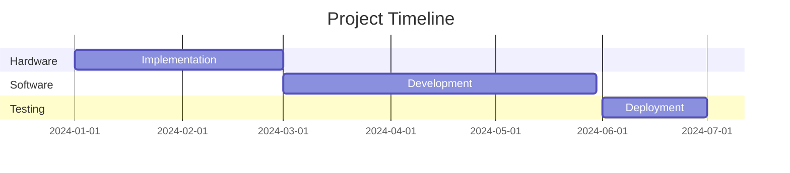

# Smart Building Automation Control System 🏢

> An IoT-based building automation solution leveraging ESP32's Arduino compatibility and built-in wireless capabilities for comprehensive building system management.

[](https://opensource.org/licenses/MIT)

## 📑 Table of Contents
- [Overview](#overview)
- [Architecture](#architecture)
- [Features](#features)
- [Implementation](#implementation)
- [Requirements](#requirements)
- [Analysis](#analysis)
- [Timeline](#timeline)
- [Setup](#setup)
- [Video Tutorials](#video-tutorials--resources)

## 🌟 Overview

The Smart Building Automation Control System is designed to provide a comprehensive solution for modern building management using ESP32-based controllers and a multi-platform software stack.

### Quick Start
```bash
git clone https://github.com/HorizonHnk/Smart-Building-Automation-System
cd smart-building-automation-system
```

## 🏗 Architecture

### Hardware Components

#### Core Controller
- ESP32 DevKit boards
  - Integrated WiFi and Bluetooth modules
  - Arduino IDE programmable
  - Multiple GPIO pins for sensor/actuator connections
  - Low power consumption capabilities

#### Control Infrastructure
- 8-channel relay modules for device control
- Environmental sensors for monitoring
- LCD/LED indicators for status display
- Backup power systems

### Software Stack

#### Embedded Systems
- Arduino C++ firmware for ESP32 controllers
- Real-time operating system (RTOS) capabilities
- Local control logic implementation

#### User Interfaces
- React Native mobile apps (iOS/Android)
- Electron-based desktop application
- Progressive Web App for browser access
- Unified UI/UX design across platforms

#### Backend Infrastructure
- Firebase for real-time data synchronization
- Secure API endpoints
- Data storage and analytics

## ⭐ Key Features

### Core Functionality
1. Direct WiFi/Bluetooth communication with mobile apps
2. Local control without internet dependency
3. Real-time monitoring and device control
4. Energy usage tracking
5. Secure wireless communication

### Advanced Capabilities
- Automated scheduling and event triggers
- Multi-zone control and monitoring
- Historical data analysis
- Remote management capabilities
- Expandable sensor network

## 📋 Implementation Phases

### Phase 1: Foundation (Months 1-2)
- [ ] Hardware prototype assembly and testing
- [ ] Basic Arduino firmware implementation
- [ ] Core communication protocols setup

### Phase 2: Development (Months 3-4)
- [ ] Mobile app UI development
- [ ] Desktop application development
- [ ] Backend infrastructure setup

### Phase 3: Integration (Months 5-6)
- [ ] System integration testing
- [ ] Security implementation
- [ ] User acceptance testing

## 💻 Technical Requirements

### Hardware Specifications
```
Operating temperature: 0-50°C
Input voltage: 5-12V DC
WiFi: 2.4GHz
Bluetooth: 4.0+
Minimum 8 relay channels
LCD display support
```

### Software Requirements
- ESP32 Arduino core
- React Native development environment
- Electron framework
- Firebase account and setup
- Development and testing tools

## 📊 Feasibility Analysis

### Technical Feasibility
> All components are readily available with extensive documentation and community support.

#### Resource Requirements
1. Development Team:
   - Embedded systems developer
   - Mobile app developer
   - Frontend developer
   - System integrator

2. Equipment:
   - Development boards
   - Testing equipment
   - Prototype components

## ⚠️ Risk Assessment and Mitigation

### Technical Risks
| Risk | Mitigation |
|------|------------|
| Wireless Communication | Implement mesh networking |
| Power Management | Battery backup systems |
| Security | Encryption protocols |

## 💰 Budget Estimation

### Hardware Costs
Component | Cost Range
----------|------------
ESP32 DevKit | $10-15
Relay modules | $8-12
Sensors | $5-20
Enclosures | $20-30

## ⏱ Timeline


## 🚀 Getting Started

### Prerequisites
```bash
# Install Arduino IDE
# Install Node.js and npm
# Install React Native CLI
```

### Installation
1. Clone the repository
2. Install dependencies
3. Configure Firebase
4. Upload firmware to ESP32
5. Run the applications

## 🎥 Video Tutorials & Resources

### Project Video Series
[](https://www.youtube.com/playlist?list=PLrZbkNpNVSwwcGFwyj8bmvJQ37gk8V6Ss)

This project includes a comprehensive video tutorial series covering all aspects of implementation:

> 📺 [Complete Smart Building Automation Tutorial Playlist](https://www.youtube.com/playlist?list=PLrZbkNpNVSwwcGFwyj8bmvJQ37gk8V6Ss)

### Video Topics Include:
- Hardware Setup & Configuration
- ESP32 Programming
- Mobile App Development
- System Integration
- Testing & Deployment

### How to Follow Along
1. Watch the videos in sequence
2. Code along with the tutorials
3. Join discussions in video comments
4. Share your progress

> 💡 **Tip**: Subscribe to the channel to get notifications about new tutorials and updates!

## 📄 License
This project is licensed under the MIT License - see the [LICENSE](LICENSE) file for details.

## 🤝 Contributing
Please read [CONTRIBUTING.md](CONTRIBUTING.md) for details on our code of conduct and the process for submitting pull requests.

---

<div align="center">
Made with ❤️ for smart buildings everywhere
</div>
